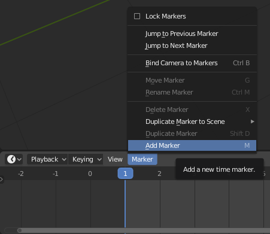
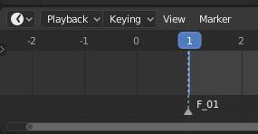
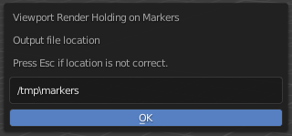
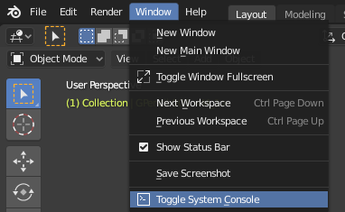
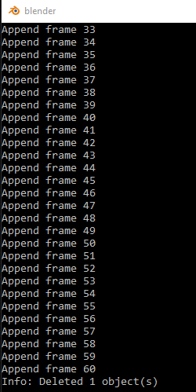

# Viewport Render Markers Blender Add-on

This add-on for Blender will do a viewport render for any scene that has markers in the timeline. It is great for previewing the pacing of an animation. It is similar in function to the Viewport Render Keyframes option in Blender.

## Features
* Quickly render a preview animation
* Render the same frame until a new timeline marker is reached

## Requirements
* Blender 2.8 or higher

## Restrictions
The Viewport Render Markers add-on will only render movie file formats and the scene must have markers in the timeline.

## Installation
In Blender's Edit menu, select "Preferences..." and then choose the Add-ons tab. Press the "Install..." button and select this zip file.

## How to use
1. Add markers to the timeline
2. In the View menu of the 3D Viewport, select Viewport Render Holding on Markers.

### Add markers to the timeline
This addon will not work unless there are markers in the timeline. Markers can be created anywhere on the timeline. Setting a marker is like setting a keyframe. Move the timeline cursor to where a marker is to be set. In the timeline Marker menu, select "Add Marker".

A new marker will appear below the timeline. Its name will correspond to the frame it was set on. Frame 1 will end up with the name F_01.

### Viewport Render Holding on Markers
In the View menu of the 3D Viewport, select Viewport Render Holding on Markers.

A new window will pop up showing the output location. If it is not correct, press the Escape key on the keyboard. Change the scene output properties and then go back to the Render menu and select "Render Images at Markers".

After pressing OK, Blender will seem to be frozen or like it has crashed. Navigate to the output folder to see the images being saved.
  
When the render process is done, the output file location window will disappear and a new window may open to report that the render has finished. Moving the mouse away from the window will make it disappear. 

### Optional Render Monitoring

For scenes with many frames to render, the rendering process can be monitored by opening the Blender System Console. From the Window menu of Blender, select Toggle System Console.

The System Console window will list each frame as it is rendered. A temporary object is deleted at the end of the rendering process.

